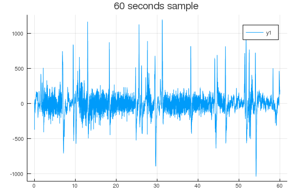

## Application of BridgeSDEInference.jl for the Jansen and Rit Neural Mass model.
### References
Model: https://mathematical-neuroscience.springeropen.com/articles/10.1186/s13408-017-0046-4, equation 4.
ABC inference: https://arxiv.org/pdf/1903.01138.pdf, section 5
### Defining the model and observation scheme:
The non-linear hypo-elliptic 6-dimensional JRNM model is defined through the function
```julia
struct JRNeuralDiffusion{T} <: ContinuousTimeProcess{ℝ{6, T}}
    A::T
    a::T
    B::T
    b::T
    C::T
    νmax::T
    v0::T
    r::T
    μx::T
    μy::T
    μz::T
    σy::T
    # constructor given assumption statistical paper
    function JRNeuralDiffusion(A::T, a::T, B::T, b::T, C::T,
            νmax::T, v0::T ,r::T, μx::T, μy::T, μz::T, σy::T) where T
        new{T}(A, a, B, b, C, νmax, v0, r, μx, μy, μz, σy)
    end
end
```
We observe discretly on time a linear combination V_t = L X_t where
```
L = @SMatrix [0. 1. -1. 0. 0. 0.]
```
### Defining the auxiliary model for the pulling term
For our purposes, we define 2 auxiliary models. One is the linearization of the original model at the final points [`JRNeuralDiffusionAux1`](https://github.com/mmider/BridgeSDEInference.jl/blob/c2b938c2c528167bf1f3231fc52ce7a452b7b865/src/JRNeural.jl#L114) and the second is the linearization of the original model for the difference the second and third dimension which we actually observe and a linearization around a point which is fixed by the user for the first dimension which we cannot observe directly [`JRNeuralDiffusionAux2`](https://github.com/mmider/BridgeSDEInference.jl/blob/c2b938c2c528167bf1f3231fc52ce7a452b7b865/src/JRNeural.jl#L222).

### Simulation and real data
As already discussed in [this note](docs/generate_data.md), in the file [simulate_JRNeural_to_csv.jl](../scripts/simulate_JRNeural_to_csv.jl) we simulate the whole process and retain at discrete time some data according to the above mentioned observation scheme. We use simulated data as a test before applying our inferential procedure to real data. Real Data are collected in EDF (european data format). We download [open source data](https://archive.physionet.org/pn6/chbmit/) and impot it with julia in [import_real_data.jl](../scripts/import_real_data.jl). Each file contains 1 hour of data with a sample frequency of 1/256 seconds. The data are recorded for several consecutive hours with some gaps which are at most 10 seconds. The data are recorded in different channels. Right now we focus on one of them. Figure below shows a sample of 60 seconds

### Statistical inference of some parameters
As discussed in https://arxiv.org/pdf/1903.01138.pdf, subsection 5.2.1., there is identifiability issues. We fix some parameters and we perform inference to the triple `σy, μy, b, C`. In the mcmc algorithm we set up a  conjugate step for `μy` and a Metropolis Hasting step for `σy` and `C`.  


